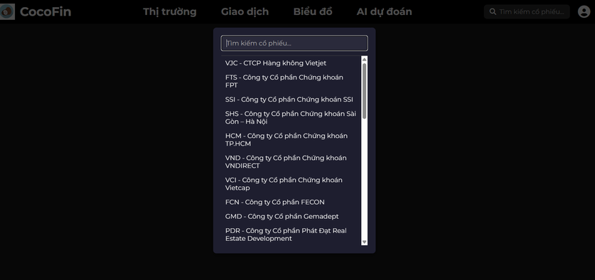
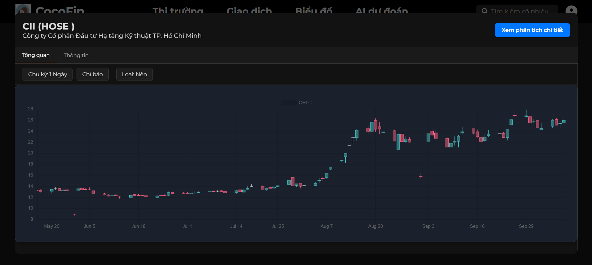
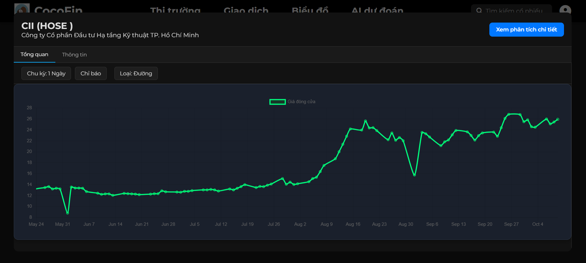
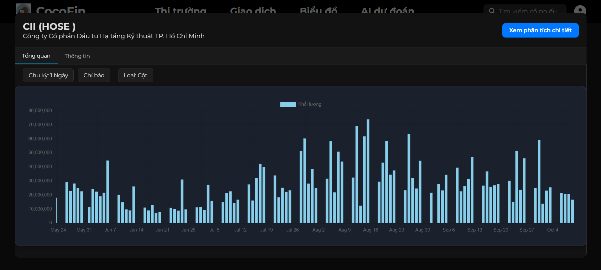
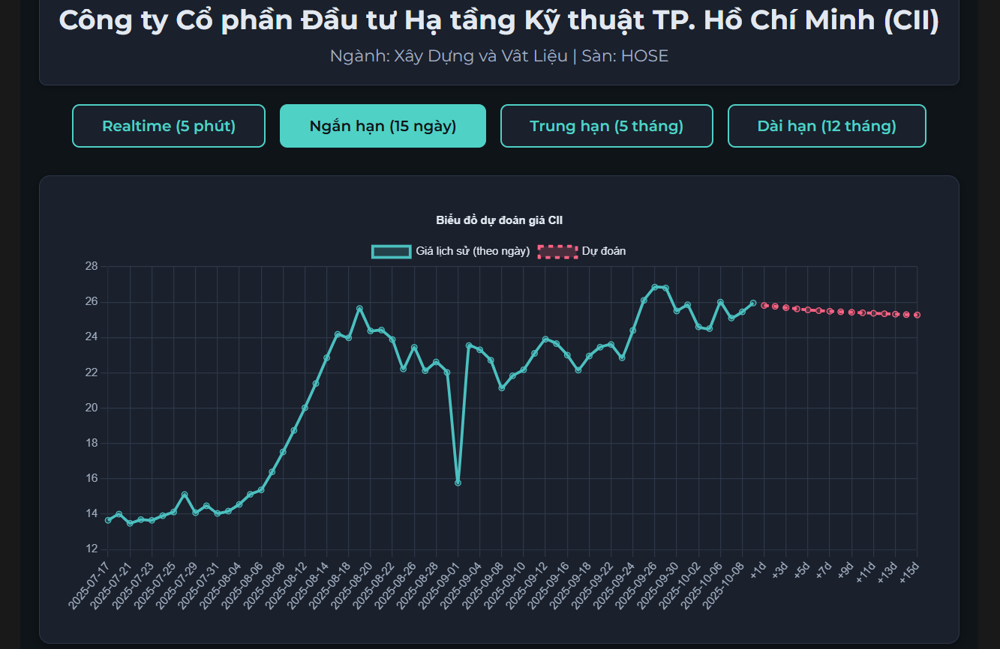
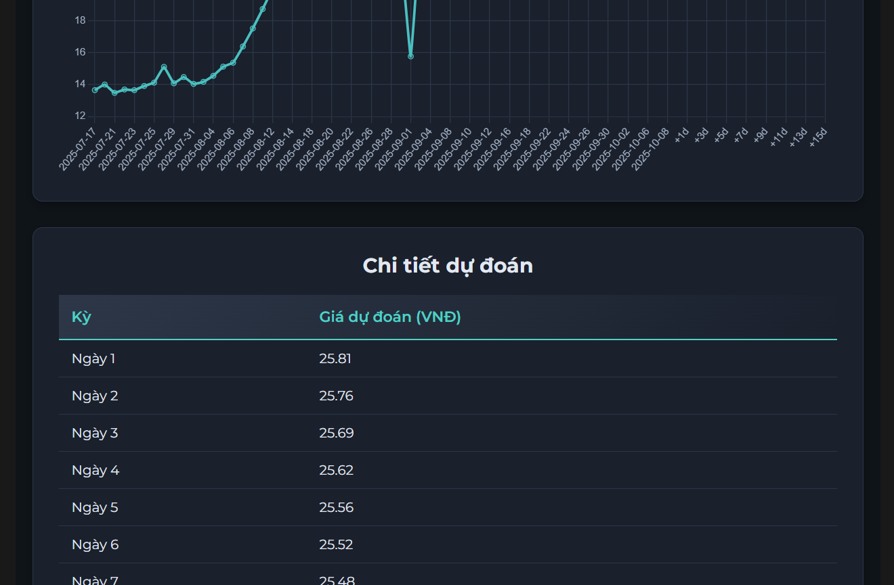
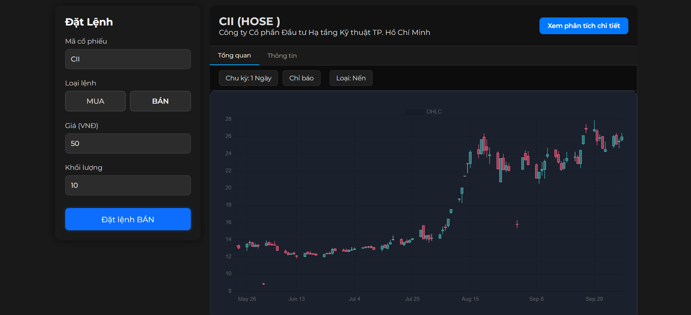
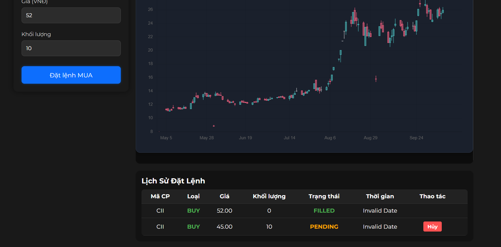

# CoCoFin - Nền Tảng Phân Tích & Đầu Tư Chứng Khoán Thông Minh

## 📈 Giới Thiệu

**CoCoFin** là nền tảng phân tích và đầu tư chứng khoán toàn diện, được xây dựng trên kiến trúc Big Data hiện đại, kết hợp sức mạnh của AI và công nghệ tiên tiến để mang đến trải nghiệm đầu tư thông minh cho mọi nhà đầu tư từ cá nhân đến tổ chức.

## 🏗️ Kiến Trúc Hệ Thống Đa Lớp

[Image of Big Data Architecture Diagram]

  
   
  <em>Kiến trúc hệ thống Big Data phân tích chứng khoán Việt Nam</em>

#### LỚP THU THẬP DỮ LIỆU (INGESTION)
Sử dụng VNStock APIs và crawler.py để thu thập dữ liệu chứng khoán từ các sàn giao dịch Việt Nam, đảm bảo dữ liệu luôn được cập nhật tự động và đa nguồn với độ tin cậy cao.

#### LỚP XỬ LÝ REAL-TIME (SPEED)
Vận hành trên nền tảng Kafka Topics và Apache Flink để xử lý stream dữ liệu thời gian thực, cung cấp khả năng phân tích và cảnh báo tức thời với độ trễ thấp cho các biến động thị trường.

#### LỚP MACHINE LEARNING (MLOps)
Tích hợp Spark MLlib cho training models, MLflow cho quản lý vòng đời model, và Model Serving để tự động hóa việc triển khai các mô hình AI dự đoán giá và xu hướng thị trường.

#### LỚP XỬ LÝ & LƯU TRỮ (BATCH/STORAGE)
Kết hợp Apache Spark cho xử lý dữ liệu quy mô lớn, Airflow cho orchestration workflow, và đa dạng hệ thống lưu trữ từ CSV files, MongoDB đến PostgreSQL để đáp ứng mọi nhu cầu dữ liệu.

#### LỚP PHỤC VỤ (SERVING)
Cung cấp Unified API Gateway thống nhất, phục vụ real-time APIs cho cả nhà đầu tư tổ chức và cá nhân, đồng thời tích hợp seamlessly các model predictions vào trải nghiệm người dùng cuối.

## ⚙️ CÀI ĐẶT

### 1. Clone repository:
git clone https://github.com/nkhanhtung/BigData3T.git

cd BigData3T

### 2. Cấu hình môi trường: Tạo file .env từ template:

cp .env.example .env

### 3. Khởi động cụm Services:
docker-compose up -d --build

### 4. Kiểm tra trạng thái: Hệ thống sẽ khởi chạy các services tại các port sau:
Web Dashboard: http://localhost:3000

API Gateway: http://localhost:8000

Airflow: http://localhost:8080

Spark UI: http://localhost:4040

## ✨ Tính Năng Nổi Bật

### 🔐 **Bảo Mật & Đăng Nhập**
- Đăng nhập an toàn với xác thực đa lớp
- Tạo tài khoản dễ dàng với đầy đủ thông tin cá nhân
- Mã hóa end-to-end cho mọi giao dịch

### 📊 **Dashboard Thông Minh**
- Tổng quan thị trường theo thời gian thực
- Công cụ tìm kiếm thông minh với gợi ý mã chứng khoán
- Navigation trực quan: Giao dịch, Biểu đồ, AI dự đoán

### 💼 **Quản Lý Giao Dịch**
- Đặt lệnh mua/bán trực tiếp trên nền tảng
- Theo dõi lịch sử đặt lệnh chi tiết
- Quản lý trạng thái lệnh: PENDING, FILLED, CANCELLED

### 📈 **Phân Tích Kỹ Thuật Chuyên Sâu**
- Đa dạng biểu đồ: Nến, Đường, Cột
- Tuỳ chọn chu kỳ: 1 ngày, 1 tuần, 1 tháng
- Công cụ phân tích chuyên sâu cho từng mã

### 🤖 **AI Dự Đoán Thông Minh**
- **Dự đoán đa khung thời gian**:
  - 📊 **Realtime** (5 phút) - Theo dõi tức thời
  - ⏳ **Ngắn hạn** (15 ngày) - Chiến lược ngắn
  - 📅 **Trung hạn** (5 tháng) - Kế hoạch trung hạn
  - 🗓️ **Dài hạn** (12 tháng) - Đầu tư dài hạn
- Biểu đồ dự đoán kết hợp lịch sử và tương lai
- Độ chính xác cao với machine learning

## 🏢 Danh Mục Mã Chứng Khoán

Hệ thống hỗ trợ đa dạng các mã chứng khoán blue-chip Việt Nam:

- **💰 Ngân Hàng**: VCB, BID, CTG, TCB, MBB, VPB, STB, ACB, SHB, HDB
- **📊 Chứng Khoán**: SSI, VND, HCM, VCI, SHS, FTS
- **🏢 Bất Động Sản**: VIC, VHM, VRE, NVL, PDR, KDH
- **🏗️ Đầu Tư Công**: CII, HBC, FCN, CTD, HHV
- **✈️ Vận Tải**: VJC, HVN, GMD, VTP, VOS, VSC

## 📱 Hình Ảnh Demo

### 🔐 Giao Diện Đăng Nhập & Đăng Ký

  
   
  <em>Đăng nhập an toàn vào tài khoản CoCoFin</em>

  
   
  <em>Tạo tài khoản mới tại CoCoFin</em>

### 📊 Dashboard & Tìm Kiếm

  
   
  <em>Dashboard tổng quan thị trường và công cụ tìm kiếm thông minh</em>

### 📈 Phân Tích Kỹ Thuật & Biểu Đồ

  <table>
    <tr>
      <td align="center">
        
         
        <em>Biểu đồ nến - Phân tích kỹ thuật chuyên sâu</em>
      </td>
      <td align="center">
        
         
        <em>Biểu đồ đường - Theo dõi xu hướng giá</em>
      </td>
    </tr>
    <tr>
      <td align="center">
        
         
        <em>Khối lượng giao dịch - Phân tích thanh khoản</em>
      </td>
    </tr>
  </table>

### 🤖 AI Dự Đoán Giá Thông Minh

  <table>
    <tr>
      <td align="center">
        
         
        <em>Giao diện dự đoán AI đa khung thời gian</em>
      </td>
      <td align="center">
        
         
        <em>Kết quả dự đoán từ AI với độ chính xác cao</em>
      </td>
    </tr>
  </table>

### 💼 Quản Lý Giao Dịch Chuyên Nghiệp

  <table>
    <tr>
      <td align="center">
        
         
        <em>Đặt lệnh mua bán - Giao diện trực quan</em>
      </td>
      <td align="center">
        
         
        <em>Quản lý lệnh - Theo dõi và hủy lệnh linh hoạt</em>
      </td>
    </tr>
  </table>

# 🛠 Công Nghệ Sử Dụng
## Frontend
React.js - Giao diện người dùng hiện đại

Chart.js - Trực quan hóa dữ liệu tài chính

WebSocket - Dữ liệu thời gian thực

Responsive Design - Tối ưu cho mọi thiết bị

## Backend
Python Flask/FastAPI - Xử lý nghiệp vụ

Apache Spark - Xử lý dữ liệu lớn

Machine Learning - Dự đoán giá

Redis - Cache hiệu năng cao

## Database
MongoDB - Lưu trữ dữ liệu phi cấu trúc

InfluxDB - Time series data

PostgreSQL - Dữ liệu giao dịch